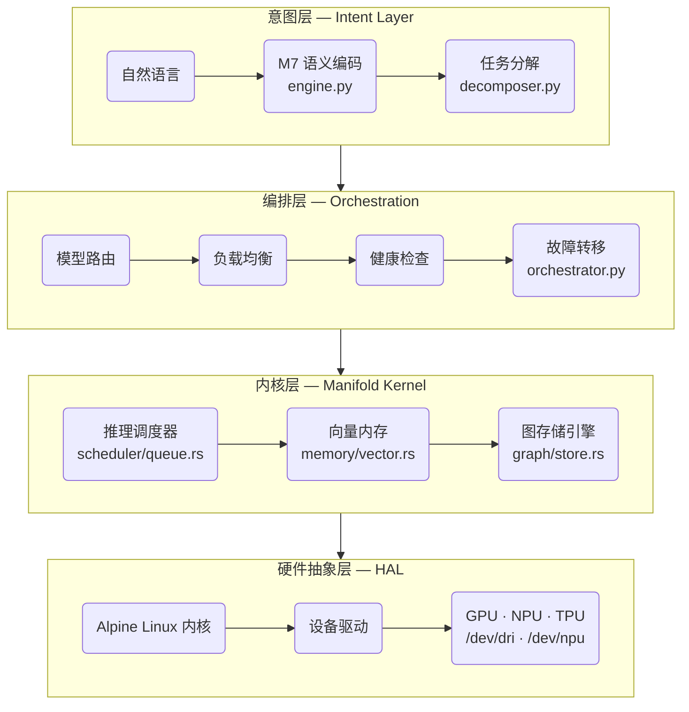

# MANIFOLD-7 (M7) 项目开发提示词

## 项目背景

MANIFOLD-7 是一个通用模型间通信协议/中间语言项目，核心目标是：
- 提高模型间通信的单位 token 表意效率
- 设计"模型母语"级别的通用中间表示
- 一个以QCOW2文件格式为载体的自进化AI操作系统


当前聚焦：构建最小可运行的 M7 原型系统，以 QCOW2 虚拟机镜像交付，完成./m7.sh run sendEmail as deepseek 命令

---

## 技术栈

| 层级 | 技术 |
|------|------|
| 基础系统 + HAL | Alpine Linux（轻量，~130MB）— Alpine 内核即硬件抽象层 |
| 图引擎 | Rust 自研（ManifoldGraph，目标体积 ~1MB） |
| 图形界面 | WASM + 浏览器渲染（跨平台） |
| Web 服务器 | lighttpd |
| 入口脚本 | POSIX sh（m7.sh） |
| 构建输出 | QCOW2 虚拟机镜像 |

> **HAL 架构决策**: Alpine Linux 自身就是硬件抽象层。内核通过 `/dev`, `/sys`, `/proc` 暴露
> NPU/GPU/TPU 设备。不需要额外的 Python HAL stub —— 硬件驱动作为 Alpine 内核模块加载。
> `build.sh` 负责将所需固件/驱动打包进 QCOW2。

---

## 文件目录结构

```
Manifold-7/
├── 0.self/                    ← M7 核心运行时
│   ├── core/                  ← 核心引擎与基础设施  编译出的镜像所在位置

│   │
│   └── executer/              ← 模型调用执行器
│       └── placeholder        ← 占位：负责下载qemu，然后完成外部大模型的调用
│
├── 1.runner/                  ← 模型配置目录
│   ├── deepseek.yaml          ← DeepSeek API 配置：端点、模型名、密钥
│   └── kimi.yaml              ← Kimi API 配置：端点、模型名、密钥
│
├── 2.usages/                  ← M7 协议文件（用例定义）
│   └── sendEmail.m7           ← 示例：发送邮件的 M7 协议模板
│
├── m7.sh                      ← 入口脚本：解析命令，调度核心与执行器
│                              ← 用法：./m7 run <usage> as <runner>
│                              ← 示例：./m7 run sendEmail as deepseek
│
└── README.md                  ← 项目文档


